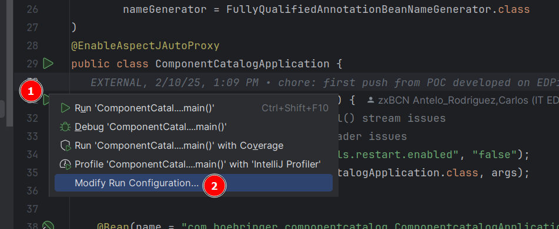
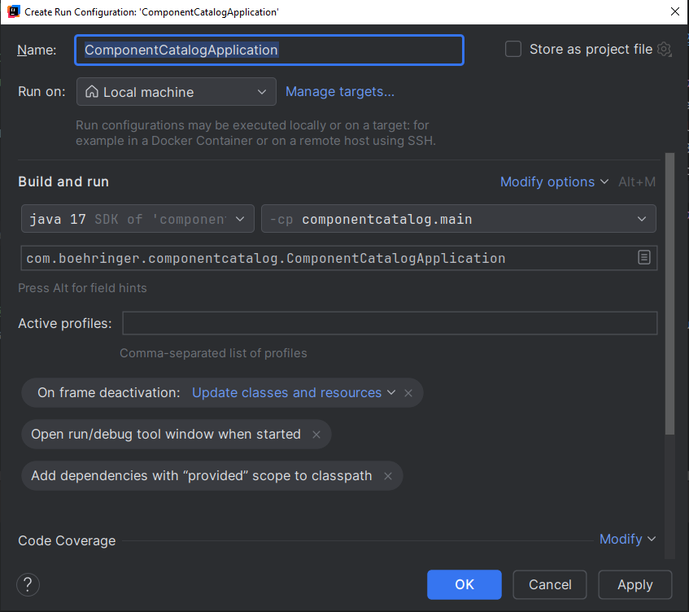
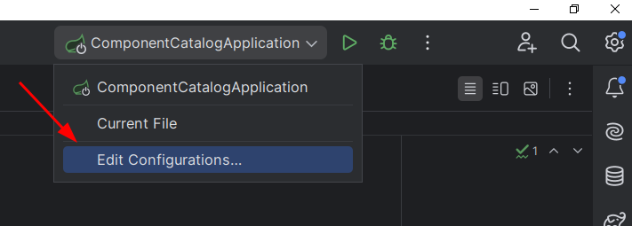
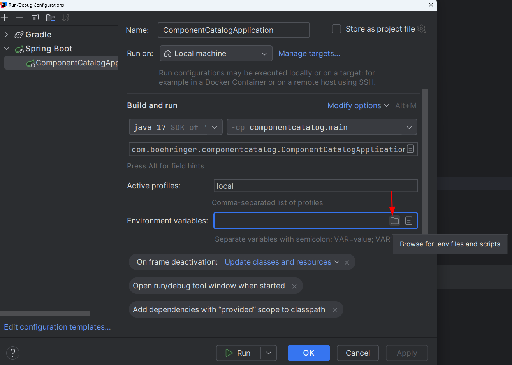
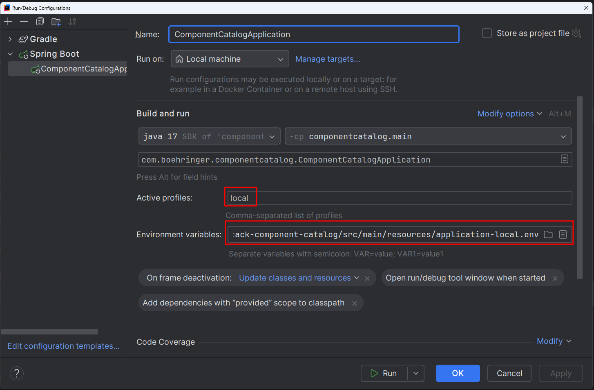

# About

This repository contains the source code for the Component Catalog backend service. 

Also, under the "scripts" directory, the required scripts and OpenAPI specifications required for generating the required API REST clients and server.

The software architecture is as follows:


# Local Development Setup - IntelliJ IDEA
For setting up a local development environment, the required steps are:
1. Create a Spring Boot launch configuration
2. Configure the Spring Boot launch configuration
3. Customize the application-local.yml file for local development
4. **(Optional)** Add the required certificates to the JVM truststore

## 1. Create a Spring Boot launch configuration
- Go to the main() method for the application: `org.opendevstack.component_catalog.ComponentCatalogApplication.main()`
- Click on its "Play" icon > Modify Run Configuration...
 


- A dialog will appear, click on "Ok" button in order to save the new launch configuration
 


## 2. Configure the Spring Boot launch configuration
This step requires setting the required env variables and the active profile to "local".

### 2.1. Customize env variables for local development
As a preliminary step to get the required env variables with the correct values for local development, 
we will copy-and-modify an env vars template file.

Do the following:
- Copy the template file: 
    - Original: `src/main/resources/application-local.env.template` 
    - Copy: `src/main/resources/application-local.env`
- Customize the copied file with the required values for local development

**NOTES** 
- Files matching the `src/main/resources/*.env` pattern are git-ignored, so they won't be accidentally committed or pushed to the repository.
- Encrypted values are currently **not** supported in the `application-local.env` file.

### 2.2. Modify the Spring Boot launch configuration

Do the following:
- Open the Run/Debug Configuration dialog



- Set the "Active profiles" to just "local" value

- Press Alt+E to enable the "Environment variables" textbox and click on the "Browse for .env files and scripts" icon:


 
- Browse and select the `src/main/resources/application-local.env` you just created

- At the end of the process, you should have a configuration similar to the following:



## 3. Customize application-local.yml file

The `application.yml` file takes some property values from the env vars, and `application-local.yml` config file 
inherits those properties and values from the `application.yml` file. 

This means that no further customization is required regarding those inherited properties and values.

Set other properties in the `application-local.yml` file as needed for local development, e.g. debug level, enabled actuators, local server port, etc.

## 4. Edit secrets in the local Vault server
To do this you will need both the tailor installation and the oc executable.
- For the tailor installation: https://github.com/opendevstack/tailor and follow the README
- For the oc console, download it from the openshift site, click on the question mark next to the user profile link
- Once everything is set, you can run the following command:
  `tailor secrets edit devstack-dev.env.enc --private-key="${ROUTE_TO_folderXYZ}/tailor-private.key" --public-key-dir="${ROUTE_TO_folderXYZ}"`
  notes:
  - press a to enter in insert mode
  - do your updates
  - press esc to exit insert mode
  - type :wq to save and exit

## 5. **(Optional)** Add the required certificates to the JVM truststore
Some HTTPS SSL connectivity issues due to missing SSL certificates can be prevented by adding the required certificates to the JVM truststore.

To do that:
1. Download the required certificates `.cert` file, e.g. get them from a web browser's address bar by clicking on the padlock icon
2. Add the certificates to the JVM truststore by running the following command:
```shell
# Command syntax:
/usr/lib/jvm/java-17-openjdk-amd64/keytool -import -alias <alias> -file <certificate-file> -keystore <path-to-jvm-truststore> -storepass <storepass> 
# Example:
/usr/lib/jvm/java-17-openjdk-amd64/keytool -import -alias us-test -file us-test-certificates.crt -keystore /usr/lib/jvm/java-17-openjdk-amd64/lib/security/cacerts -storepass changeit
```

**NOTES** 
- The certificate should be added to the truststore for the JDK that IntelliJ IDEA uses to *run* the application. 
- The default JVM truststore password is `changeit`

# Catalog & CatalogItem Bitbucket Repositories

**TODO** link to the documentation for the required directory structure and Catalog(Item).yaml specifications 

# Security and local development
In order to get access to the different bickbucket repositories, the local development environment needs to be configured with the required credentials. Those credentials will be part of the request, as a token.

To get the token for the local development, feel free to get security token from any page where azure SSO is required. (you can also execute the script below in your browser console)
```javascript
javascript:(function(){let value=JSON.parse(localStorage[Object.keys(localStorage).find(key=>key.includes('idtoken'))])['secret'];navigator.clipboard.writeText(value);alert('Token copied to clipboard');})();
```

# Azure tokens
That's important to know, that tokens are environment dependent. I mean, if you have configured your local environment to use the `dev` environment, you will need to get the token from a `dev` azure page, or Front app in DEV.
If you have configured your local environment to use the `local` environment, you will need to get the token from a `local` azure page, or Front app in LOCAL.

